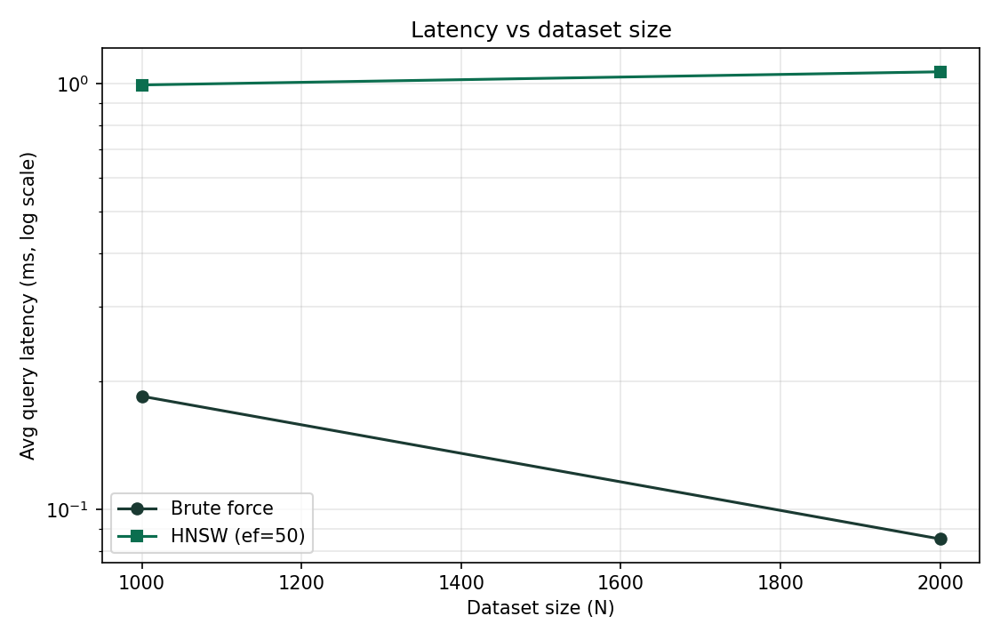
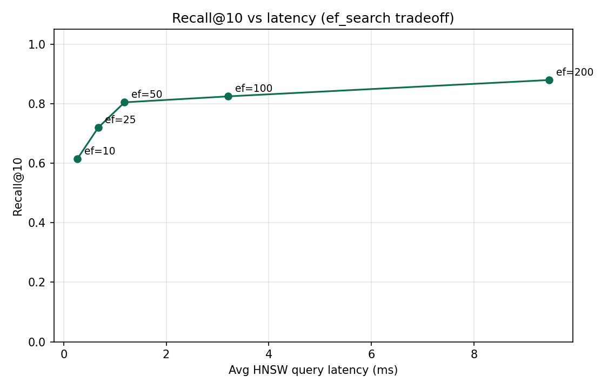

# fashionAI

Visual fashion search engine using CLIP embeddings and a from-scratch HNSW implementation for approximate nearest neighbor search.

## Demo

<video src="docs/demo.mp4" controls playsinline width="100%"></video>

[Download demo video](docs/demo.mp4) · text search with side-by-side HNSW vs brute-force results and live latency readout.

### Try it locally

```bash
# 1. Python env
python3 -m venv .venv && source .venv/bin/activate
pip install -r requirements.txt

# 2. Put fashion product images in data/images/ (or nested data/images/images/),
#    then embed with CLIP → embeddings.npy + metadata.json
python data/prepare_dataset.py --max-samples 2000

# 3. API (terminal 1)
uvicorn backend.main:app --reload --port 8000

# 4. Frontend (terminal 2)
cd frontend && npm install && npm run dev
```

Open [http://localhost:5173](http://localhost:5173). The UI searches with `method: "both"` so you can compare HNSW against exact brute-force results and latencies side by side.

Optional benchmarks:

```bash
python benchmarks/benchmark.py
```

## Architecture

```
Fashion images
      │
      ▼
 CLIP (ViT-B/32)  ──►  512-d L2-normalized embeddings
      │
      ├──►  BruteForceIndex   (exact cosine / ground truth)
      └──►  HNSWIndex         (from-scratch ANN)
                │
                ▼
           FastAPI  POST /search
                │
                ▼
        React + Vite frontend
     (side-by-side results + latency)
```

- **`data/prepare_dataset.py`** — load local images, batch-embed with Hugging Face CLIP, write `embeddings.npy` + `metadata.json`
- **`index/brute_force.py`** — exact top-k via dot product + `np.argpartition`
- **`index/hnsw.py`** — simplified HNSW built from scratch (no FAISS / hnswlib)
- **`backend/main.py`** — loads indexes + CLIP once at startup; serves `/search` and static `/images`
- **`frontend/`** — single-page React UI

## How HNSW works

Think of a city subway map. The local bus network (layer 0) stops at every corner — complete, but slow if you start from the wrong side of town. Express subway lines (upper layers) have fewer stops and let you cross the city quickly. Once you're in the right neighborhood, you hop off and use the buses to walk the last few blocks. Hierarchical Navigable Small World (HNSW) graphs are that idea applied to vector search.

Every embedding is a node. Nodes are linked to a handful of nearby neighbors (up to `M` edges per layer). Almost every node appears on the dense bottom layer. A random minority are also promoted onto sparser upper layers, with the chance of appearing higher up dropping off exponentially — same geometric layer assignment used in the original Malkov & Yashunin paper: `level = floor(-ln(U) * 1/ln(M))`. The result is a hierarchy: coarse “express” links on top, fine-grained links underneath.

**Search** starts at an entry point on the highest occupied layer and greedily walks to the neighbor closest to the query (here “closest” means highest cosine similarity — a simple dot product, because CLIP vectors are L2-normalized). When no neighbor is closer, the algorithm drops one layer and repeats, using the landing point from above as the new entry. On the bottom layer it widens the beam to `ef_search` candidates so it can recover from early greedy mistakes, then returns the top-`k`. Larger `ef_search` means more of the bottom graph is explored: higher recall, higher latency — a knob you can turn.

**Insertion** mirrors search. A new vector is assigned a random max layer, then the same greedy descent finds good attachment points. At each layer the new node connects to its `M` nearest already-inserted neighbors (chosen from an `ef_construction`-wide candidate list), and those neighbors prune back to `M` edges if they overflow. Build quality is controlled by `ef_construction`; query quality/speed by `ef_search`.

This repo’s `index/hnsw.py` implements that pipeline in plain Python + NumPy — adjacency lists per layer, greedy descent, ef-bounded search — intentionally kept readable for portfolio / interview walkthroughs rather than maximally optimized.

## Results

Benchmarks run on **N = 2,000** CLIP embeddings (512-d), **20** text queries, `M = 16`, `ef_construction = 100`, against a NumPy brute-force baseline. Plots:





**Latency vs size.** At N = 1,000 / 2,000, vectorized brute force (a single matrix–vector multiply) is still faster than the pure-Python HNSW walk — ~0.09–0.19 ms vs ~1.0 ms per query at `ef_search = 50`. That’s expected: ANN’s asymptotic win shows up when N grows into the tens or hundreds of thousands and exact search becomes the bottleneck. The plot is set up to include 5k / 10k points once a larger catalog is embedded (`--max-samples 0` on the full Myntra dump).

**Recall vs speed.** Sweeping `ef_search` on the full 2k set:

| ef_search | Recall@10 | Avg latency (ms) |
|----------:|----------:|-----------------:|
| 10        | 0.615     | 0.27             |
| 25        | 0.720     | 0.67             |
| **50**    | **0.805** | **1.19**         |
| 100       | 0.825     | 3.21             |
| 200       | 0.880     | 9.47             |

At the default **`ef_search = 50`**, HNSW recovers **recall@10 ≈ 0.81** — about four out of five exact top-10 neighbors — in roughly a millisecond of index time. Pushing `ef_search` to 200 lifts recall to **0.88** at ~8× the latency. That curve is the practical tradeoff the frontend’s side-by-side view is meant to illustrate.

Re-run after embedding more images:

```bash
python benchmarks/benchmark.py
```

## What I'd extend with more time

- **Disk persistence** — save/load the HNSW graph so API startup doesn’t rebuild from vectors every cold start (a basic pickle path exists; a versioned on-disk format would be better).
- **Product quantization (PQ)** — compress 512-d float32 vectors into compact codes to cut memory and speed distance estimates at catalog scale.
- **Distributed indexing** — shard the graph across workers for multi-million-item catalogs; fan out queries and merge top-k.
- **Image-based queries** — CLIP already embeds images into the same space as text; wire an upload path so “find similar products” works from a photo, not only a caption.

## Tech stack

| Layer | Tools |
|-------|--------|
| Embeddings | PyTorch, Hugging Face Transformers (`openai/clip-vit-base-patch32`) |
| Data | NumPy, Pillow, tqdm; local fashion product images (+ optional `styles.csv`) |
| Indexes | Pure Python + NumPy (brute force & HNSW from scratch) |
| API | FastAPI, Uvicorn, Pydantic |
| Frontend | React, Vite, Tailwind CSS |
| Benchmarks | Matplotlib |
| Notebook | Jupyter (`notebooks/explore.ipynb`) |
